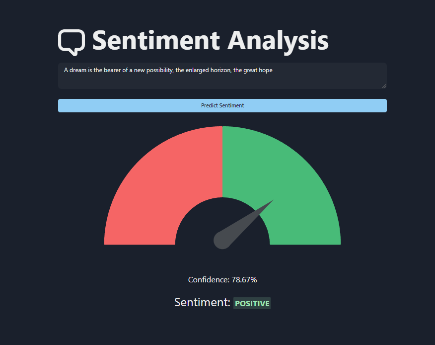
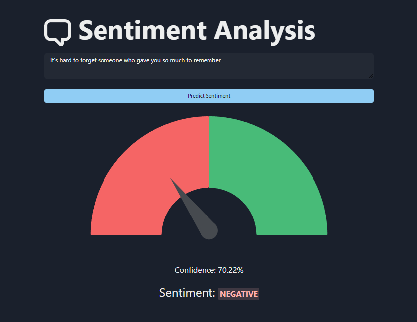

## Frontend for Sentiment Analysis Using Deep Learning
### Setup
* npm install
* npm run dev

## How to use
1. Initialize the backend server which can be found at `https://github.com/niranjanblank/SentimentAnalysisBackend`
2. Install the dependencies using `npm install`
3. Run the development server using `npm run dev`

## Output
### Positive Example

### Negative Example
